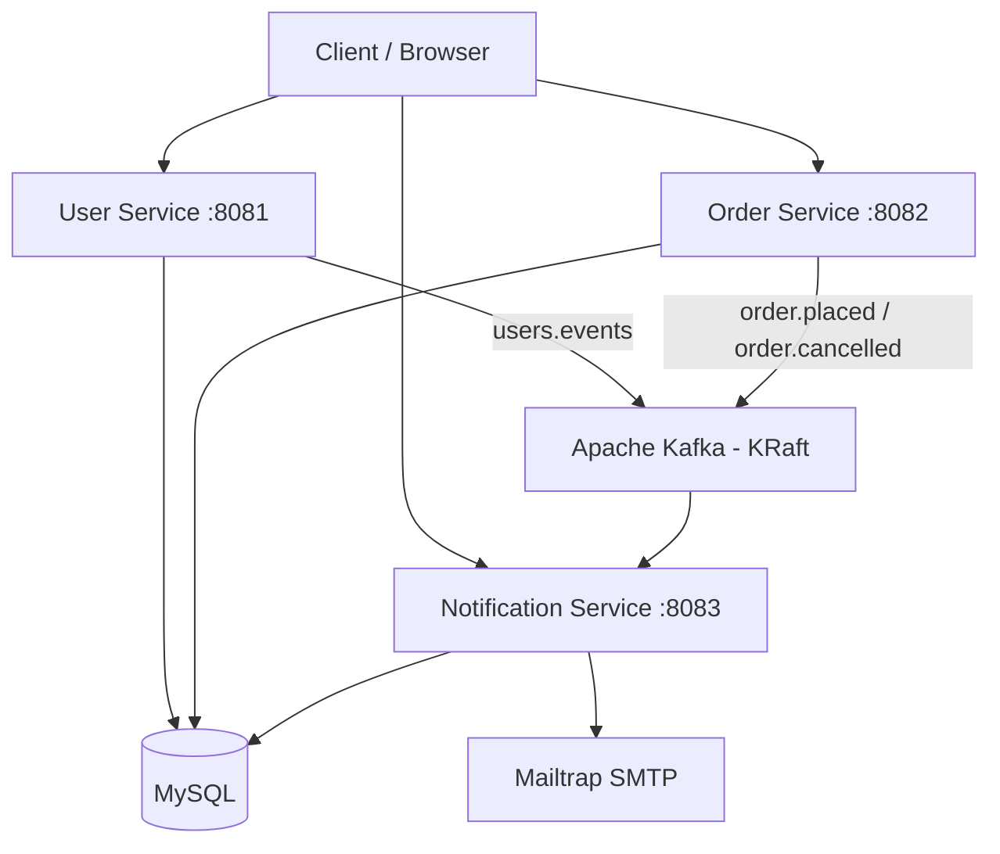
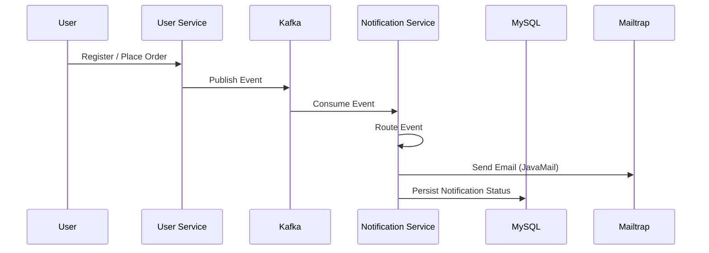
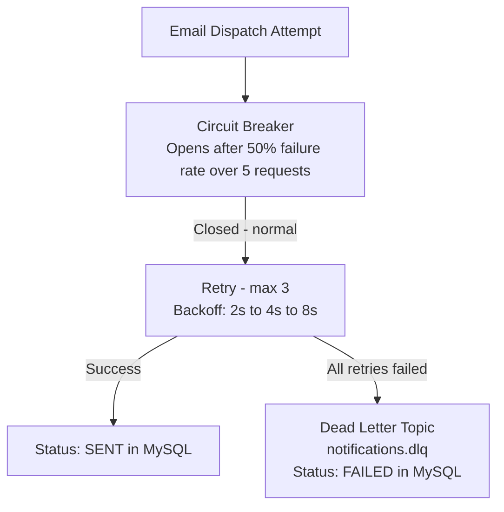
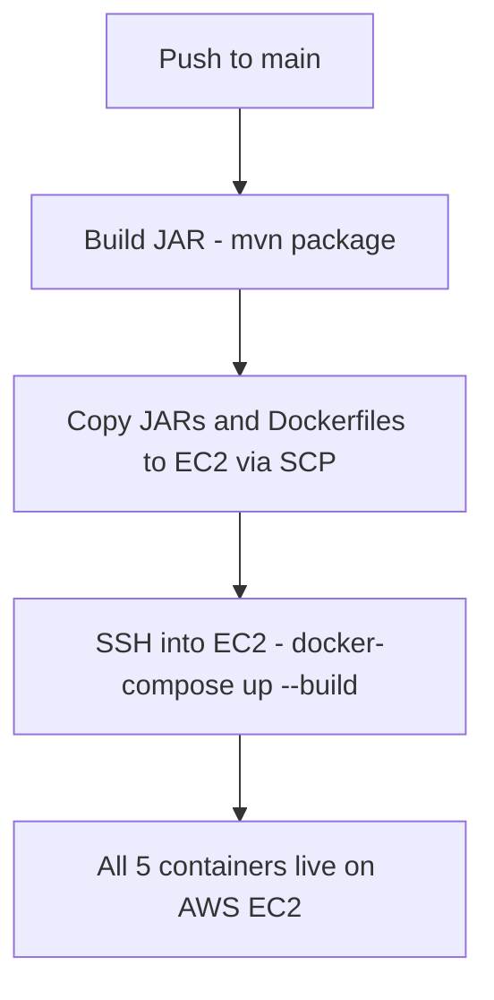

# 🚀 Distributed Notification Service

A production-grade, **event-driven notification system** built with **Spring Boot Microservices** and **Apache Kafka**. Three independent services communicate asynchronously via Kafka topics — User Service and Order Service publish events, Notification Service consumes them and dispatches real emails via JavaMail with Freemarker templates.

The system is built using an **event-driven architecture** powered by **Apache Kafka**, with **Resilience4j**, **MySQL**, **JavaMail**, and **Docker**.

---

## ✨ Key Features

- 🔐 JWT Authentication & Login (User Service)
- 👤 User Registration with Event Publishing
- 🛒 Order Placement & Cancellation
- ⚡ Apache Kafka Event Processing (KRaft mode, no Zookeeper)
- 📧 Real Email Dispatch via JavaMail + Freemarker Templates
- 🔄 Resilience4j Retry with Exponential Backoff
- 🛡️ Circuit Breaker Protection
- 💀 Dead Letter Queue (DLQ) for Failed Notifications
- 📊 Notification History & Status Tracking
- 🩺 Spring Actuator Health Checks
- 🐳 Docker & Docker Compose
- 🔧 CI/CD via GitHub Actions → AWS EC2

---

# 🛠 Tech Stack

| Category | Technology |
|----------|------------|
| Language | Java 21 |
| Framework | Spring Boot 3.4.5 |
| Security | Spring Security + JWT (jjwt 0.11.5) |
| Messaging | Apache Kafka (KRaft mode) |
| ORM | Spring Data JPA + Hibernate |
| Database | MySQL 8.0 |
| Email | JavaMail (SMTP) + Freemarker |
| Resilience | Resilience4j (Retry, Circuit Breaker) |
| Observability | Spring Boot Actuator |
| Containerization | Docker & Docker Compose |
| CI/CD | GitHub Actions → AWS EC2 |

---

# 🏗 Microservices

## User Service

Responsible for:

- User Registration
- User Login
- JWT Token Generation
- Publishing `UserRegisteredEvent` to Kafka

---

## Order Service

Responsible for:

- Placing Orders
- Cancelling Orders
- Fetching Orders by User
- Publishing `OrderPlacedEvent` and `OrderCancelledEvent` to Kafka

---

## Notification Service

Responsible for:

- Kafka Event Consumption
- Event Routing
- Email Dispatch (JavaMail + Freemarker)
- Retry & Circuit Breaker (Resilience4j)
- Dead Letter Queue Handling
- Notification History Persistence

---

# 🚀 Features

## Authentication

- User Registration
- User Login
- JWT Authentication

## Order Management

- Place Order
- Cancel Order
- View Orders by User

## Notifications

- Event-Driven Email Dispatch
- Retry with Exponential Backoff
- Circuit Breaker Protection
- Dead Letter Queue on Failure
- Notification History API
- Unread Count API

---

# 🏛 System Architecture



---

# 🔄 Notification Flow



---

# 🛡️ Resilience Flow



---

# 📂 Project Structure

```
Distributed-Notification-Service
│
├── User/Service
│
├── Order/Service
│
├── Notification/Service
│
├── docker-compose.yml
│
├── init.sql
│
└── README.md
```

---

# 🎯 Design Principles

The project follows several software engineering best practices:

- Event-Driven Architecture
- Loose Coupling via Kafka (publish-and-forget)
- Separation of Concerns
- Layered Architecture
- Circuit Breaker Pattern
- Retry Pattern with Exponential Backoff
- Dead Letter Queue Pattern
- Repository Pattern
- DTO Pattern

---

# 🚀 Getting Started

## Prerequisites

Before running the project, ensure you have the following installed:

- Java 21
- Maven 3.9+
- Docker Desktop
- Git

---

## Clone the Repository

```bash
git clone https://github.com/userShashwat/MicroSerivce-Kafka.git

cd MicroSerivce-Kafka
```

---

## Set Up Mailtrap (Free SMTP Sandbox)

Sign up at [mailtrap.io](https://mailtrap.io/) → Email Testing → Inboxes → SMTP Settings → copy your username and password.

Update `docker-compose.yml`:

```yaml
notification-service:
  environment:
    SPRING_MAIL_USERNAME: your_mailtrap_username
    SPRING_MAIL_PASSWORD: your_mailtrap_password
    MYSQL_ROOT_PASSWORD: your_mysql_password
```

---

## 🐳 Running with Docker

Start all services

```bash
docker-compose up --build -d
```

This starts 5 containers:

- `kafka` — Apache Kafka (KRaft, port 9092)
- `mysql` — MySQL 8.0 (port 3307)
- `user-service` — port 8081
- `order-service` — port 8082
- `notification-service` — port 8083

Verify everything is running

```bash
docker ps
```

All 5 containers should show `Up` and `Healthy`.

Stop all containers

```bash
docker-compose down
```

View logs

```bash
docker-compose logs -f
```

---

# 🧪 Testing the Full Flow

Register a user

```bash
curl -X POST http://localhost:8081/api/auth/register \
  -H "Content-Type: application/json" \
  -d '{"name": "Shashwat", "email": "test@gmail.com", "password": "password123"}'
```

Place an order

```bash
curl -X POST http://localhost:8082/api/orders \
  -H "Content-Type: application/json" \
  -d '{"userId": 1, "product": "MacBook Pro", "quantity": 1, "price": 150000}'
```

Cancel an order

```bash
curl -X PATCH http://localhost:8082/api/orders/1/cancel
```

Check notification history

```bash
curl http://localhost:8083/api/notifications/user/1
```

Check health

```bash
curl http://localhost:8083/actuator/health
```

Expected response:

```json
{
  "status": "UP",
  "components": {
    "db": { "status": "UP" },
    "mail": { "status": "UP" },
    "ping": { "status": "UP" }
  }
}
```

---

# 📚 API Reference

| Service | Endpoint | Method | Description |
|---------|----------|--------|-------------|
| User | `/api/auth/register` | POST | Register new user |
| User | `/api/auth/login` | POST | Login and get JWT token |
| Order | `/api/orders` | POST | Place a new order |
| Order | `/api/orders/{id}/cancel` | PATCH | Cancel an order |
| Order | `/api/orders/user/{userId}` | GET | Get orders by user |
| Notification | `/api/notifications/user/{userId}` | GET | Get notification history |
| Notification | `/api/notifications/user/{userId}/unread-count` | GET | Get unread count |
| Notification | `/actuator/health` | GET | Health check (DB, Mail, Kafka) |
| Notification | `/actuator/metrics` | GET | Service metrics |

---

# 🗄 Database Schema

**`notification_db` — `notifications` table**

| Column | Type | Description |
|--------|------|-------------|
| `id` | BIGINT PK | Auto-increment |
| `user_id` | BIGINT | References user |
| `email` | VARCHAR | Recipient email |
| `notification_type` | ENUM | `USER_REGISTERED`, `ORDER_PLACED`, `ORDER_CANCELLED` |
| `status` | ENUM | `PENDING`, `SENT`, `FAILED`, `SKIPPED` |
| `payload` | TEXT (JSON) | Full event payload stored for debugging |
| `retry_count` | INT | 0 to 3 — incremented on each retry |
| `created_at` | TIMESTAMP | When event was received |
| `sent_at` | TIMESTAMP | When notification was dispatched |

---

# 🔧 CI/CD Pipeline

Every push to `main` triggers the GitHub Actions pipeline:



---

# 💡 Design Decisions

**Why Kafka instead of REST calls between services?**
REST calls create tight coupling — if Notification Service is down, User Service registration fails. With Kafka, User Service publishes the event and forgets. Notification Service picks it up whenever it's ready. No data loss, no coupling.

**Why separate Kafka topics for order events?**
With a single `order.events` topic and multiple consumer groups, both consumer groups received every message — causing `OrderPlacedEvent` to be misread as `OrderCancelledEvent`. Separate `order.placed` and `order.cancelled` topics eliminate this entirely.

**Why KRaft instead of Zookeeper?**
Zookeeper is deprecated in newer Kafka versions. KRaft mode allows Kafka to manage its own metadata without an external coordinator — simpler setup, fewer containers.

**Why Resilience4j over manual retry?**
Manual retry logic is error-prone and hard to test. Resilience4j provides annotation-based retry and circuit breaker with exponential backoff — declarative, testable, and production-standard.

---

# 👨‍💻 Author

**Shashwat Sharma**

B.Tech CSE — KIIT University, Bhubaneswar (2023–2027)

Passionate about Backend Development, Microservices, and Distributed Systems.

---

# ⭐ Support

If you found this project useful, consider giving it a ⭐ on GitHub.
